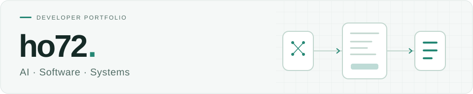

<picture>
  <source media="(prefers-color-scheme: dark)" srcset="assets/header-dark.svg">
  <source media="(prefers-color-scheme: light)" srcset="assets/header-light.svg">
  
</picture>

# 이호철

**AI를 서비스로 연결하고, 일상에 필요한 도구를 만듭니다.**

VLM 학습·검증과 문서 자동화 도구를 개발했습니다. 생활 속 필요에서 출발한 웹서비스는 인증부터 배포·운영까지 직접 구성합니다.

[프로젝트](#대표-프로젝트) · [개인 서비스](#직접-만들고-운영하는-서비스) · [기술](#사용한-기술) · [경험](#경험과-학습)

## 대표 프로젝트

### [01 · PET-I](https://github.com/ho72/pet-i-vlm-diagnosis)

반려견 안구 질환 분류·설명 VLM · 4인 졸업프로젝트

안구 사진에서 질환을 분류하고 증상을 설명하는 모델입니다. 설명형 데이터 생성·전처리, **Qwen3-VL LoRA 학습·검증**, YOLO 패딩 크롭과 검색 컨텍스트 구현을 맡았습니다. 반복 생성 오류와 크롭 과정의 문맥 손실을 분석해 학습 입력을 개선했습니다.

- **평가** — 7개 분류·700장 기준 Macro F1 **0.6935 → 0.7404**, 최종 정확도 **74.00%**
- **팀 수상** — 건국대학교 2025학년도 생성형 AI 활용 사례 공모전 **우수상**

Python · PyTorch · Qwen3-VL-8B · Unsloth / LoRA · YOLOv8

[프로젝트 소개](https://github.com/ho72/pet-i-vlm-diagnosis) · [실험과 문제 해결](https://github.com/ho72/pet-i-vlm-diagnosis/blob/main/docs/DEVELOPMENT.md) · [데이터 생성 코드](https://github.com/ho72/pet-i-explanation-data)

### [02 · TacticAI Monitoring](https://github.com/ho72/tacticai-monitoring)

AI 대전 플랫폼의 Kubernetes 모니터링 · 4인 팀 프로젝트

여러 서비스와 Pod의 상태를 함께 볼 수 있도록 **Prometheus Operator·Grafana 모니터링**을 담당했습니다. ServiceMonitor로 메트릭을 자동 수집하고, Mock-up 환경에서 AI Server Pod를 **3개 → 5개**로 확장해 설정 변경 없이 신규 Pod의 지표가 표시되는 것을 검증했습니다.

Kubernetes · Prometheus · Grafana · Docker

[구현과 검증 화면](https://github.com/ho72/tacticai-monitoring) · [팀 프로젝트](https://github.com/KU-TacticAI)

### [03 · 회의록 생성기](https://github.com/ho72/meeting-notes-generator)

음성 업로드 → 전사·검토 → 회의록 생성·보관 · 개인 프로젝트

로컬 Whisper로 회의 음성을 전사하고, **사용자가 수정한 전사문**을 바탕으로 회의록을 생성합니다. 편집·저장·Markdown 다운로드를 연결하고, 작업 대기열과 실패 처리·회귀 테스트를 구성했습니다.

Python · FastAPI · faster-whisper · Gemini API · JavaScript

[기능과 실행 방법](https://github.com/ho72/meeting-notes-generator)

## 직접 만들고 운영하는 서비스

생활 속 필요에서 출발한 개인 웹서비스입니다. AI 코딩 도구와 함께 기획·구현하고, 공통 인증을 연결하되 서비스별 데이터는 분리해 관리합니다.

| 공개 코드 | 해결하는 일 |
| :--- | :--- |
| [공통 인증 서버](https://github.com/ho72/unified-auth-server) | 여러 서비스의 소셜 로그인·사용자 계정·토큰 관리 |
| [사진·파일 공유](https://github.com/ho72/home-media-sharing) | 앨범 권한, 사진·영상 처리와 파일 공유 |
| [스마트홈 관리](https://github.com/ho72/smart-home-manager) | 기기 제어, 자동화와 알림을 한 화면에서 관리 |
| [AI 개발 워크스페이스](https://github.com/ho72/ai-coding-workspace) | 브라우저에서 코딩 에이전트와 작업하고 대화·파일 보관 |

## 사용한 기술

  
  
  
  
  
  
  
  

**AI·데이터** — LoRA / Unsloth · YOLOv8 · Whisper · 검색 컨텍스트

**웹·운영** — Fastify · Prisma · SQLite · OAuth2 / JWT · Linux · Prometheus / Grafana

## 경험과 학습

- **소프트웨어 개발 실무** — AI 문서 자동화, 재고관리 개선, 드론 GCS 분석·수정
- **해군 CERT** — Linux 서버·네트워크 관제, 장애 대응과 점검 자동화
- **건국대학교 컴퓨터공학부 졸업** · **SSAFY 16기 Java Track 교육 중**

작은 프로젝트도 살펴보기

- [Python TCP 채팅](https://github.com/ho72/tcp-cli-chat) — 소켓·스레드 기반 터미널 채팅
- [Dijkstra 시각화](https://github.com/ho72/dijkstra-visualizer) — 최단 경로 알고리즘 시각화

